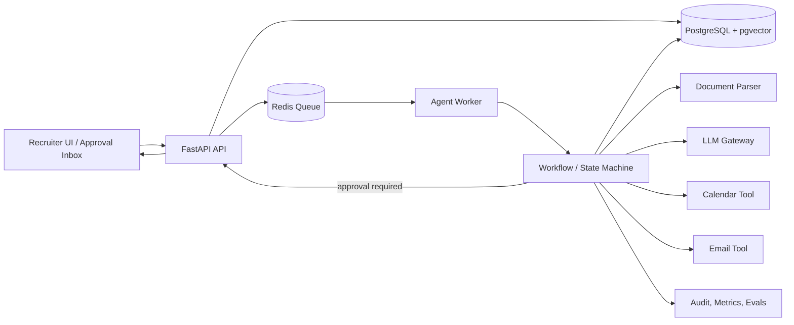

# Kế hoạch mở rộng TalentFlow theo hướng Agentic AI

## 1. Mục tiêu

Chuyển TalentFlow từ workflow AI-assisted chạy đồng bộ thành hệ thống có thể tự nhận sự kiện, lập kế hoạch công việc, gọi công cụ, theo dõi kết quả, retry và xin phê duyệt đúng lúc.

Agentic AI trong dự án này không có nghĩa là để LLM tự quyết định tuyển hoặc loại ứng viên. Mục tiêu là tự động hóa công việc vận hành lặp lại, đồng thời giữ recruiter ở các checkpoint có ảnh hưởng đến con người.

Kết quả kỳ vọng:

- CV mới được xử lý nền, không giữ request HTTP trong lúc chờ AI.
- Hệ thống chủ động tạo task tiếp theo thay vì recruiter phải bấm từng bước.
- Recruiter nhận một approval inbox tập trung cho tiêu chí, shortlist, outreach và ngoại lệ.
- Lịch trống, email mời, reminder và reschedule dùng công cụ thật.
- Mọi hành động có trạng thái, evidence, audit trail, chi phí và khả năng chạy lại.
- Chất lượng được đo bằng bộ eval thay vì chỉ quan sát demo.

## 2. Điểm xuất phát thực tế

| Năng lực | Hiện tại | Khoảng trống để thành agentic |
|---|---|---|
| Phân tích JD | Gọi OpenRouter, fallback rules | Chưa có version, confidence gate, vòng lặp chỉnh sửa |
| Nhận CV | Recruiter upload; hệ thống dedupe theo owner/job/checksum | Chưa có inbox/source connector |
| Screening | Durable task + Redis/RQ worker, retry và resume | Chưa có confidence routing và semantic embedding |
| Evidence | Xác minh exact quote | Chưa có citation span/page, eval độ chính xác |
| Semantic match | Lexical proxy | Chưa có embedding, pgvector, calibration |
| Shortlist | Sort theo `final_score`, recruiter bấm duyệt | Chưa tự tạo proposal khi batch hoàn tất, chưa có policy/rationale cấp job |
| Interview kit | Sinh ngay khi screening | Chưa version theo criteria và chưa đánh giá chất lượng |
| Review | Recruiter mở từng hồ sơ | Chưa ưu tiên ngoại lệ/rủi ro, chưa gom approval inbox |
| Scheduling | Slot và meeting URL giả lập | Chưa kết nối calendar, email, timezone, reschedule |
| Follow-up | Chưa có | Chưa gửi reminder, theo dõi phản hồi hoặc escalation |
| Audit | Có audit log, agent run/step, provider/model/prompt/fallback | Chưa có token/cost và artifact lineage |
| Hạ tầng | Compose chạy PostgreSQL, Redis và RQ worker | pgvector sẽ được thêm ở Phase 2 |

## 3. Phân chia mức tự động hóa

Sử dụng 5 mức để tránh gọi mọi tính năng có AI là “agent”:

- **L0 — thủ công:** recruiter tự thực hiện toàn bộ.
- **L1 — assist:** AI tạo nháp, con người chủ động gọi và sử dụng kết quả.
- **L2 — workflow:** hệ thống tự chạy chuỗi bước cố định sau một sự kiện.
- **L3 — bounded agent:** agent chọn tool/bước tiếp theo trong policy, có giới hạn và checkpoint.
- **L4 — autonomous operation:** tự thực thi và giám sát trong phạm vi rủi ro thấp, chỉ escalates ngoại lệ.

TalentFlow nên hướng tới L3 cho screening/scheduling operations và L2 cho giao tiếp. Quyết định reject/hire luôn có người chịu trách nhiệm.

| Công việc đang thủ công | Tự động hóa đề xuất | Mức đích | Human gate |
|---|---|---:|---|
| Kiểm tra JD và bấm duyệt | Agent phân tích thiếu/mâu thuẫn, đề xuất criteria + câu hỏi làm rõ | L2 | Recruiter duyệt criteria |
| Upload CV từ từng nguồn | Connector nhận file từ inbox/folder/ATS và chống trùng | L3 | Chỉ duyệt nguồn/kết nối |
| Chờ batch xử lý trên màn hình | Queue chia task theo CV, retry có kiểm soát, cập nhật progress | L3 | Chỉ xử lý ngoại lệ |
| Mở từng candidate | Agent gom strong match, gap, evidence yếu và anomaly | L3 | Recruiter review proposal |
| Bấm tạo Top 5 | Tự tạo shortlist proposal khi job/batch đạt điều kiện | L3 | Bắt buộc duyệt trước outreach |
| Tự chọn người cần phỏng vấn | Policy tạo review queue theo điểm/rủi ro/độ bất định | L3 | Không tự reject/hire |
| Tìm giờ trống | Scheduling agent đọc calendar của các bên và đề xuất giao | L3 | Candidate chọn; recruiter cấu hình policy |
| Soạn/gửi email | Sinh từ template, kiểm tra policy rồi gửi qua provider | L2–L3 | Duyệt template/lần gửi đầu hoặc case nhạy cảm |
| Nhắc lịch và đổi lịch | Theo dõi phản hồi, reminder, conflict và reschedule | L4 phạm vi hẹp | Escalate sau N lần thất bại |
| Tổng hợp feedback | Chuẩn hóa scorecard, phát hiện thiếu feedback, tóm tắt | L3 | Hiring team duyệt kết luận |

## 4. Kiến trúc mục tiêu



### Thành phần nên bổ sung

1. **Durable task queue:** Redis + worker thật. Giai đoạn đầu có thể dùng RQ/Celery; mọi task phải idempotent và có retry policy.
2. **Workflow state machine:** lưu trạng thái từng node trong database. Chỉ thêm LangGraph khi cần branching, checkpoint và tool routing; không bắt buộc dùng framework cho chuỗi cố định.
3. **Tool adapters:** interface thống nhất cho parser, LLM, embeddings, email và calendar. Agent không gọi SDK provider trực tiếp.
4. **Approval service:** tạo approval request, policy, timeout, người phê duyệt và payload trước/sau khi duyệt.
5. **Outbox:** ghi ý định gửi email/tạo lịch trong transaction, worker thực thi sau để tránh gửi trùng.
6. **Observability/evals:** trace theo `agent_run_id`, đo latency, token/cost, retry, fallback và kết quả eval.

## 5. Các agent theo domain

Không cần tạo một “super agent”. Chia thành các agent hẹp với input/output có schema:

### 5.1. Job Intake Agent

- Nhận JD, chuẩn hóa title/department/location.
- Trích xuất requirements và phân loại required/preferred.
- Phát hiện yêu cầu mâu thuẫn, mơ hồ hoặc có nguy cơ thiên kiến.
- Sinh câu hỏi làm rõ và criteria proposal có version.
- Dừng tại `CRITERIA_APPROVAL_REQUIRED`.

### 5.2. Screening Agent

- Parse tài liệu, kiểm tra chất lượng text và duplicate checksum.
- Extract candidate profile có schema validation.
- Chạy rule match, embedding match, evidence verification và scoring.
- Retry parser/model theo policy; fallback rules khi provider lỗi.
- Chuyển hồ sơ bất định sang `MANUAL_REVIEW_REQUIRED` thay vì tự suy đoán.

### 5.3. Shortlist Agent

- Chạy khi batch hoàn tất hoặc đạt ngưỡng số CV/thời gian.
- Xếp hạng theo criteria version hiện hành.
- Sinh proposal gồm rationale, coverage, gaps và confidence.
- Kiểm tra duplicate, evidence yếu, score sát ngưỡng và bất thường.
- Dừng tại `SHORTLIST_APPROVAL_REQUIRED`; không tự gửi thư mời.

### 5.4. Scheduling Agent

- Đọc availability từ calendar adapter với timezone rõ ràng.
- Tìm giao giữa interviewer, duration, buffer và working hours.
- Gửi các lựa chọn đã được policy cho phép cho candidate.
- Khi candidate chọn, kiểm tra conflict lần cuối rồi tạo event/meeting.
- Tự gửi reminder và xử lý reschedule trong giới hạn số lần cấu hình.

### 5.5. Follow-up Agent

- Theo dõi delivery/reply/webhook và deadline.
- Nhắc candidate/interviewer theo template được duyệt.
- Escalate recruiter khi bounce, không phản hồi sau N lần, hoặc nội dung ngoài scope.
- Sau phỏng vấn, nhắc scorecard và tổng hợp feedback; không kết luận hire/reject.

## 6. State machine đề xuất

```text
JOB_DRAFT
 -> CRITERIA_EXTRACTING
 -> CRITERIA_APPROVAL_REQUIRED
 -> JOB_ACTIVE

CV_RECEIVED
 -> PARSING
 -> PROFILE_EXTRACTING
 -> MATCHING
 -> EVIDENCE_VERIFYING
 -> SCREENED
 -> MANUAL_REVIEW_REQUIRED (khi confidence thấp/lỗi)

SCREENED_SET_READY
 -> SHORTLIST_PROPOSED
 -> SHORTLIST_APPROVAL_REQUIRED
 -> OUTREACH_READY
 -> CONTACTING
 -> SCHEDULING
 -> INTERVIEW_SCHEDULED
 -> FEEDBACK_PENDING
 -> PROCESS_COMPLETE
```

Mỗi transition cần có `actor`, `reason`, `input_version`, `output_artifact_id`, timestamp và idempotency key. Trạng thái lỗi phải phân biệt `RETRYABLE`, `PERMANENT` và `NEEDS_HUMAN`.

## 7. Lộ trình triển khai

### Phase 0 — Làm chắc nền tảng hiện tại

**Trạng thái: hoàn thành.** Chi tiết kiểm chứng nằm trong [implementation checklist](./IMPLEMENTATION_CHECKLIST.md).

Mục tiêu: có baseline đáng tin trước khi tăng quyền tự động.

- Viết migration bằng Alembic thay cho `create_all` khi startup.
- Tách config theo local/staging/production và validate biến môi trường.
- Sửa Docker worker thành process thật hoặc bỏ khỏi Compose cho đến khi dùng.
- Chuẩn hóa status enum, error code và timestamp UTC.
- Thêm pagination/filter cho applications, jobs và audit logs.
- Thêm test auth/tenant isolation, upload limit, prompt fallback và booking race condition.
- Tạo bộ CV/JD eval đã ẩn danh với expected requirements/evidence/ranking.

**Definition of done:** CI chạy migration + tests; không còn hạ tầng “có tên nhưng chưa dùng”; có baseline quality/latency/cost.

### Phase 1 — Async screening có khả năng resume

**Trạng thái: hoàn thành.** API extract text mà không lưu file gốc, persist task trước khi enqueue; chi tiết kiểm chứng nằm trong [implementation checklist](./IMPLEMENTATION_CHECKLIST.md).

Mục tiêu: upload trả về nhanh, worker tự xử lý an toàn.

- `POST /application-batches` extract text, không lưu file gốc, persist metadata/task rồi enqueue screening.
- Worker xử lý độc lập từng CV; batch aggregate progress từ task states.
- Retry exponential backoff, timeout, dead-letter queue và nút retry thủ công.
- Dedupe bằng checksum trong phạm vi owner/job và policy rõ ràng.
- Lưu `agent_runs`, node executions, model/provider, prompt version và fallback reason.
- Frontend poll/SSE progress thật thay vì timer mô phỏng.

**Definition of done:** worker restart không mất task, upload không gửi trùng application, batch partial failure có thể retry riêng từng file.

### Phase 2 — Screening/shortlist agent có approval inbox

**Trạng thái: hoàn thành.** Criteria có version/lineage, rescreen dùng lại durable task, embedding được lưu bằng pgvector trên PostgreSQL, score được calibration bằng eval và mọi shortlist chỉ là proposal chờ duyệt trong approval inbox.

Mục tiêu: hệ thống chủ động tạo proposal, recruiter chỉ xử lý quyết định cần người.

- Tạo criteria version và rescreen khi criteria thay đổi.
- Thêm embeddings + pgvector; giữ rule score riêng để giải thích.
- Calibrate score/confidence bằng eval set, không dùng LLM score trực tiếp.
- Tự tạo shortlist proposal theo trigger cấu hình.
- Tạo approval inbox cho criteria, evidence yếu, shortlist và policy violations.
- Lưu diff giữa đề xuất AI và quyết định recruiter để phục vụ eval.

**Definition of done:** thay criteria sinh version mới và rerun có lineage; không có outreach trước khi shortlist được duyệt.

### Phase 3 — Calendar và email thật

**Trạng thái: đã hoàn thành implementation, chờ acceptance test với tenant OAuth thật.** Adapter Google/Microsoft, token encryption/refresh, free-busy, event lifecycle, email versioning, webhook ingestion, candidate scheduling link và transactional outbox đã có test offline. Profile local vẫn dùng provider giả lập có chủ đích.

Mục tiêu: tự động hóa từ shortlist đã duyệt đến lịch phỏng vấn.

- OAuth per recruiter/company cho Google Calendar hoặc Microsoft 365.
- Calendar adapter: free/busy, create/update/cancel event, webhook sync.
- Email adapter: template, send, delivery/bounce/reply webhook.
- Candidate scheduling page có token hết hạn, timezone và accessibility.
- Outbox + idempotency key cho mọi external side effect.
- Policy cho working hours, buffer, interviewer pool, reminder và reschedule.

**Definition of done:** tạo lịch thật không trùng, gửi đúng một email, webhook cập nhật trạng thái, revoke connection dừng mọi thao tác.

### Phase 4 — Follow-up và interview operations

**Trạng thái: hoàn thành.** Reminder và feedback deadline được lên lịch bền vững; reschedule bị giới hạn bằng policy; bounce/no-show/timeout/out-of-scope và feedback mâu thuẫn được chuyển vào approval inbox.

Mục tiêu: giảm công việc điều phối sau khi đã có lịch.

- Reminder theo mốc thời gian và trạng thái delivery.
- Tự đề xuất slot mới khi interviewer conflict hoặc candidate xin đổi lịch.
- Thu scorecard có cấu trúc, nhắc người chưa nộp.
- Tóm tắt feedback kèm nguồn và đánh dấu ý kiến mâu thuẫn.
- Escalation rules cho no-show, bounce, quá hạn và nội dung ngoài policy.

**Definition of done:** happy path không cần recruiter bấm sau khi duyệt outreach; mọi ngoại lệ xuất hiện trong inbox với next action rõ ràng.

### Phase 5 — Tối ưu và tích hợp nguồn ứng viên

**Trạng thái: hoàn thành implementation nền tảng.** Shared tenant/RBAC, quota và kill switch, push connector gateway có consent/provenance, export/delete/retention và champion/challenger có regression gate đã có test offline. Adapter upstream cụ thể và model/provider thật vẫn cần acceptance test; sourcing agent bị vô hiệu hóa cho tới khi từng nguồn được phê duyệt pháp lý.

Mục tiêu: mở rộng sau khi core workflow đã đo được chất lượng.

- Connector email/folder/ATS để ingest CV có consent và provenance.
- Tenant/RBAC, retention policy, export/delete candidate data.
- A/B test prompt/policy; champion/challenger cho model và ranking.
- Budget/rate limit theo tenant; cache và batch inference.
- Chỉ xem xét sourcing agent sau đánh giá pháp lý và điều khoản của từng nguồn.

**Definition of done:** connector có permission tối thiểu, audit đầy đủ, xóa dữ liệu theo retention và không scrape nguồn trái điều khoản.

### Phase 6 — Production readiness và observability

**Trạng thái: hoàn thành implementation offline, chờ acceptance với tenant provider thật.** Liveness/readiness đã được tách riêng; production gate kiểm tra database, queue, auth, seed, HTTPS, OAuth, webhook và secret placeholder. Tenant operations API tổng hợp screening success/latency, outbox failure/backlog, approval aging và quota. Runbook quy định acceptance matrix và rollback.

Mục tiêu: chỉ nhận traffic và tăng rollout khi hạ tầng, cấu hình bảo mật và workflow side effect đều có bằng chứng vận hành.

- Tách liveness khỏi readiness để process sống không bị hiểu nhầm là hệ thống sẵn sàng.
- Chặn readiness ở staging/production khi còn SQLite, eager queue, tắt auth/seed demo hoặc URL không HTTPS.
- Kiểm tra OAuth credentials, token encryption, webhook secret và active tenant connection cho provider thật.
- Xuất metrics tenant-scoped cho task success, P50/P95 step latency, outbox backlog/failure, approval SLA và AI usage.
- Viết acceptance matrix cho OAuth, idempotency, webhook replay, retry, restart, tenant isolation và kill switch.
- Canary rollout và rollback bằng kill switch; không xóa outbox/task lỗi trước điều tra.

**Definition of done:** code/test offline hoàn thành; production acceptance chỉ hoàn thành khi `/api/operations/readiness` không còn blocker và toàn bộ matrix có evidence từ tenant Google/Microsoft thật.

### Phase 7 — SLO alerting và canary release gate

**Trạng thái: hoàn thành implementation offline.** Tenant có policy SLO riêng; evaluator biến telemetry thành alert có dedupe, acknowledge, recovery và auto-resolve. Release gate lưu bằng chứng baseline/canary và chặn promotion khi thiếu mẫu hoặc hồi quy reliability, latency, cost hay side effect.

Mục tiêu: biến dữ liệu quan sát thành quyết định vận hành có trạng thái và audit, thay vì phụ thuộc người trực tự đọc dashboard.

- Cấu hình cửa sổ đo, success-rate floor, P95 ceiling, outbox/approval threshold và budget warning.
- Một rolling alert cho mỗi tenant/signal; lần đánh giá lặp tăng occurrence thay vì tạo alert storm.
- Cho phép acknowledge thủ công; evaluator tự resolve khi signal phục hồi và reopen khi tái diễn.
- Canary gate yêu cầu sample tối thiểu và so sánh cả absolute SLO lẫn regression so với baseline.
- Mọi thay đổi policy, alert action và release evaluation đều có audit trail.
- Giữ tenant boundary cho policy, alert và release evidence.

**Definition of done:** migration + API + tests offline hoàn thành; môi trường thật cần gọi evaluator định kỳ, nối alert receiver/on-call và dùng `PROMOTION_ALLOWED` làm điều kiện bắt buộc trong deployment pipeline.

### Phase 8 — Operational automation và enforced promotion

**Trạng thái: hoàn thành implementation offline.** API tự đăng ký sweep định kỳ vào RQ scheduler, mỗi alert episode chỉ tạo một notification outbox có retry/idempotency. Promotion endpoint kiểm tra đồng thời canary result, readiness và critical alerts; CLI CI/CD fail-closed gọi đúng gate này.

Mục tiêu: đóng vòng từ telemetry đến cảnh báo và từ canary evidence đến quyết định rollout thực thi được.

- Lên lịch global SLO sweep khi API khởi động trên profile Redis; interval cấu hình bằng environment.
- Chỉ evaluate tenant đã có SLO policy, tránh tạo state ngoài ý muốn.
- Gửi email on-call qua transactional outbox; cùng alert episode không tạo notification trùng.
- Recovery rồi tái diễn tạo episode/notification mới, giữ lịch sử occurrence trên cùng rolling alert.
- Promotion chỉ hợp lệ khi gate là `PROMOTION_ALLOWED`, tenant readiness đạt và không còn critical alert active.
- Lưu người/thời điểm promote; replay promotion trả cùng kết quả.
- CLI deployment thoát mã khác 0 khi thiếu cấu hình, không có gate hoặc server từ chối promotion.

**Definition of done:** scheduler/notification/promotion enforcement có test offline; production cần cấu hình recipient thật, RQ scheduler HA và đặt CLI gate trước bước chuyển traffic.

## 8. Thay đổi dữ liệu và API ưu tiên

### Bảng mới

| Bảng | Dữ liệu chính |
|---|---|
| `agent_runs` | workflow, status, trigger, current node, model/prompt version, cost |
| `agent_steps` | input/output artifact, tool, retry count, latency, error |
| `tasks` | queue state, idempotency key, attempts, scheduled time |
| `artifacts` | requirements/profile/evidence/shortlist versions và lineage |
| `approval_requests` | type, payload, risk, assignee, decision, expiry |
| `outbox_events` | side effect chờ gửi, provider key, delivery status |
| `communications` | template, channel, recipient, provider/message status |
| `calendar_connections` | provider, owner, encrypted credential reference, scopes |
| `evaluation_results` | dataset case, version, metrics, pass/fail |

Không lưu access/refresh token calendar trực tiếp trong JSON application; dùng secret manager hoặc trường mã hóa với key rotation.

### API mới/tách lại

```text
POST /api/jobs/{id}/analyze
POST /api/jobs/{id}/activate
POST /api/batches/{id}/retry
GET  /api/runs/{id}
GET  /api/approvals
POST /api/approvals/{id}/decide
POST /api/jobs/{id}/shortlist-proposals
POST /api/shortlist-proposals/{id}/approve
POST /api/applications/{id}/outreach-drafts
POST /api/outreach-drafts/{id}/approve
GET  /api/calendar/connections
POST /api/scheduling-links
POST /api/webhooks/{provider}
GET  /api/live
GET  /api/ready
GET  /api/operations/readiness
GET  /api/operations/metrics
GET/PUT /api/operations/slo-policy
POST /api/operations/evaluate
GET  /api/operations/alerts
POST /api/operations/alerts/{id}/action
POST /api/operations/release-gates
```

Các endpoint cũ có thể giữ làm compatibility layer trong một phiên bản rồi deprecate.

## 9. Guardrails bắt buộc

- Không tự động `HIRE` hoặc `REJECT` chỉ dựa trên model/score.
- Không suy luận hoặc dùng thuộc tính nhạy cảm: tuổi, giới, dân tộc, tôn giáo, tình trạng hôn nhân, sức khỏe, địa chỉ và ảnh.
- Evidence phải trỏ về đoạn/page nguồn; claim không có nguồn được đánh dấu là chưa xác minh.
- Tool permissions theo least privilege; calendar mặc định chỉ free/busy trước khi được cấp quyền tạo event.
- Email chỉ dùng template/version được duyệt; giới hạn recipient, tần suất và giờ gửi.
- Side effect phải có idempotency key và dry-run/preview cho recruiter.
- Prompt injection trong CV được coi là dữ liệu, không phải instruction; parser tách content khỏi system/tool policy.
- PII redaction, encryption, retention, delete/export và audit access phải có trước khi dùng dữ liệu thật.
- Model/provider failure không được âm thầm biến thành kết luận; phải ghi fallback và giảm confidence.
- Kill switch theo tenant và theo tool để dừng email/calendar mà không dừng toàn hệ thống.

## 10. Evals và chỉ số thành công

### Chất lượng AI

- Requirement extraction precision/recall trên bộ JD chuẩn.
- Evidence citation precision và tỷ lệ quote trỏ đúng nguồn.
- Ranking agreement: NDCG@5 hoặc Spearman với đánh giá hội đồng.
- Tỷ lệ hồ sơ bị chuyển manual vì confidence thấp.
- Recruiter override rate theo criteria/shortlist và lý do override.
- Kiểm tra fairness theo nhóm chỉ khi có cơ sở pháp lý, consent và dữ liệu phù hợp.

### Vận hành

- P50/P95 thời gian từ CV received đến screened.
- Queue age, success rate, retry rate, dead-letter rate.
- Chi phí LLM trên mỗi CV/job và tỷ lệ dùng fallback.
- Tỷ lệ email delivery/bounce/reply.
- Thời gian từ shortlist approved đến interview scheduled.
- Conflict, duplicate event, duplicate message và reschedule rate.

### Giá trị sản phẩm

- Phút recruiter thao tác trên mỗi candidate.
- Tỷ lệ approval được xử lý trong SLA.
- Tỷ lệ ứng viên hoàn tất self-scheduling.
- Thời gian tuyển dụng theo từng giai đoạn, không chỉ tổng time-to-hire.

Mỗi release thay đổi prompt/model/scoring phải chạy eval regression và chặn deploy nếu vượt ngưỡng lỗi đã thống nhất.

## 11. Backlog ưu tiên gần nhất

### P0 — cần làm trước

1. Alembic migrations và status enums.
2. Agent run/task schema + idempotency key.
3. Redis worker thật và async batch API.
4. Progress thật trên UI, retry từng CV và dead-letter view.
5. Eval dataset + baseline cho extraction/evidence/ranking.
6. Test tenant isolation, concurrency và external side effects.

### P1 — tạo trải nghiệm agentic

1. Criteria versions và approval inbox.
2. Embedding/pgvector với score calibration.
3. Trigger tự tạo shortlist proposal.
4. Confidence/anomaly routing sang manual review.
5. Trace đầy đủ model/tool/cost/fallback.

### P2 — tự động hóa vận hành

1. Calendar connector và self-scheduling page.
2. Email drafts, approval policy, outbox và webhooks.
3. Reminder/reschedule/escalation agent.
4. Structured interview feedback và summary có nguồn.

## 12. Mốc demo đề xuất

- **Demo A — Durable screening:** upload 20 CV, đóng/mở worker, task tiếp tục và UI hiện progress thật.
- **Demo B — Bounded agent:** thêm JD, agent hỏi phần còn thiếu, recruiter duyệt, shortlist proposal tự xuất hiện.
- **Demo C — Tool-using agent:** sau khi duyệt outreach, hệ thống gửi email sandbox, candidate chọn lịch và calendar event được tạo đúng một lần.
- **Demo D — Exception handling:** provider lỗi/conflict/bounce; agent retry đúng policy rồi đưa case vào approval inbox.

Thứ tự này ưu tiên độ tin cậy và khả năng kiểm soát trước độ “tự trị”. Khi hoàn thành Phase 3, TalentFlow mới có đầy đủ đặc trưng agentic quan trọng: event-driven, durable state, tool use, bounded autonomy, human approval và measurable outcomes.
