# AI Recruitment Agent
## Hệ thống Agent tuyển dụng tự động: Sàng lọc CV & Lên lịch phỏng vấn

> Project Design Document  
> Mục tiêu: xây dựng một ứng dụng tuyển dụng có **AI Agent**, **pipeline chạy end-to-end**, có thể **self-host**, ưu tiên công nghệ **open source**, dễ demo và dễ mở rộng.

---

# 1. Tổng quan đề tài

## 1.1. Tên đề tài đề xuất

**AI Recruitment Agent – Hệ thống hỗ trợ sàng lọc CV và tự động hóa lịch phỏng vấn bằng AI Agent**

## 1.2. Bài toán

Trong quy trình tuyển dụng truyền thống, recruiter phải:

- Đọc nhiều CV thủ công.
- So sánh CV với Job Description (JD).
- Tìm ứng viên phù hợp.
- Tổng hợp điểm mạnh/yếu.
- Liên hệ ứng viên.
- Tìm thời gian phù hợp để phỏng vấn.
- Tạo lịch và gửi xác nhận.

Đề tài xây dựng một hệ thống AI Agent hỗ trợ tự động hóa các công việc trên.

## 1.3. Mục tiêu

Hệ thống cần:

1. Cho phép recruiter tạo Job Description.
2. Upload CV dạng PDF/DOCX.
3. Parse nội dung CV.
4. Trích xuất hồ sơ ứng viên thành dữ liệu có cấu trúc.
5. Phân tích JD thành các yêu cầu tuyển dụng.
6. Match CV với JD bằng nhiều phương pháp.
7. Sinh điểm phù hợp và evidence.
8. Đưa ra recommendation cho recruiter.
9. Cho phép human review.
10. Hỗ trợ lên lịch phỏng vấn.
11. Lưu lịch sử pipeline.
12. Chạy được bằng Docker Compose.
13. Có CI pipeline cho source code.

---

# 2. Phạm vi hệ thống

## 2.1. MVP

Luồng chính:

```text
Job Description
      ↓
Upload CV
      ↓
Parse CV
      ↓
Extract Candidate Profile
      ↓
Match CV với JD
      ↓
Evidence + Score
      ↓
Recommendation
      ↓
Recruiter Review
      ↓
Schedule Interview
```

## 2.2. Không làm trong MVP

Không nên mở rộng quá sớm sang:

- LinkedIn scraping.
- Tự động đăng job lên nhiều nền tảng.
- AI voice interview.
- Video interview.
- Personality detection.
- AI tự động quyết định hire/reject.
- Multi-company SaaS.
- Payroll/HRM.
- Background check.

---

# 3. Nguyên tắc thiết kế

## 3.1. AI là decision-support

AI không nên tự động quyết định:

```text
HIRE
REJECT
```

Thay vào đó hệ thống sinh:

```text
Strong Match
Potential Match
Needs Review
```

Quyết định cuối cùng thuộc recruiter.

## 3.2. Human-in-the-loop

Pipeline phải có bước:

```text
AI Recommendation
      ↓
Recruiter Review
      ↓
Recruiter Decision
```

## 3.3. Explainable AI

Không chỉ trả:

```text
Score: 87
```

Mà phải giải thích:

```text
FastAPI: MATCH
Evidence:
"Built REST APIs using FastAPI..."

Docker: NOT FOUND
Evidence:
No relevant evidence found in CV.
```

## 3.4. Pipeline-first

Không xây hệ thống theo kiểu:

```text
CV
 ↓
Prompt
 ↓
LLM
 ↓
Score
```

Thay vào đó:

```text
Parse
 ↓
Extract
 ↓
Validate
 ↓
Rule Matching
 ↓
Semantic Matching
 ↓
Evidence Analysis
 ↓
Score Aggregation
 ↓
Recommendation
```

---

# 4. Tech Stack

## 4.1. Stack đề xuất

| Thành phần | Công nghệ |
|---|---|
| Frontend | Next.js |
| UI | Tailwind CSS |
| Backend | FastAPI |
| Agent Orchestration | LangGraph |
| CV Parser | Docling |
| Local LLM Runtime | Ollama |
| Embedding | sentence-transformers |
| Database | PostgreSQL |
| Vector Search | pgvector |
| Queue | Redis |
| Background Worker | Celery / RQ |
| Deployment | Docker Compose |
| Testing | Pytest |
| CI/CD | GitHub Actions |

> Trước khi nộp báo cáo chính thức, cần kiểm tra lại license của từng dependency và từng model LLM cụ thể được chọn.

---

# 5. Kiến trúc tổng thể

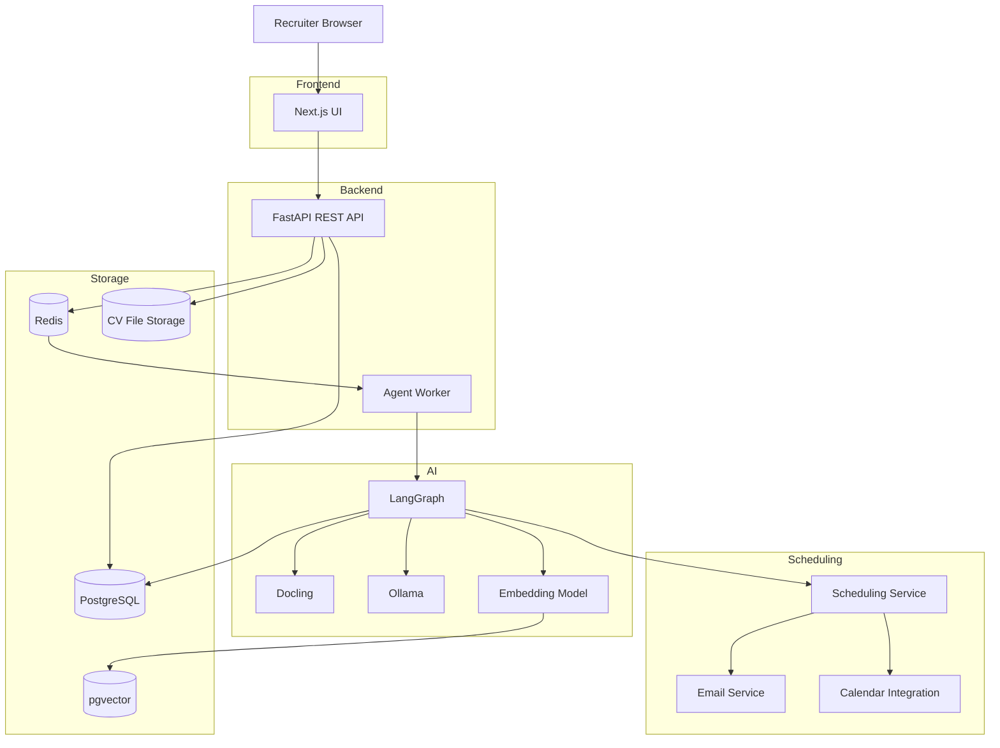

---

# 6. Activity Diagram tổng thể

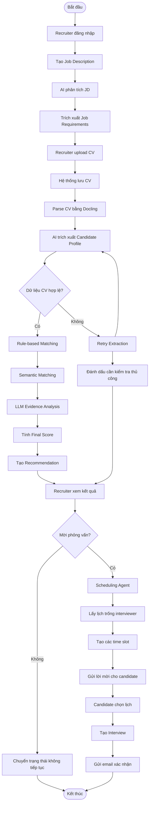

---

# 7. Activity Diagram dạng Swimlane

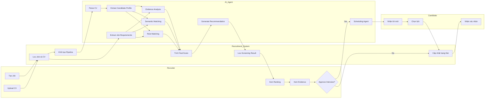

---

# 8. AI Recruitment Pipeline

Đây là pipeline trung tâm của đề tài.

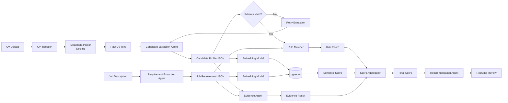

Pipeline logic:

```text
CV
 ↓
Parse
 ↓
Extract
 ↓
Validate
 ↓
Match
 ↓
Evidence
 ↓
Score
 ↓
Recommendation
 ↓
Human Review
```

---

# 9. LangGraph Agent Workflow

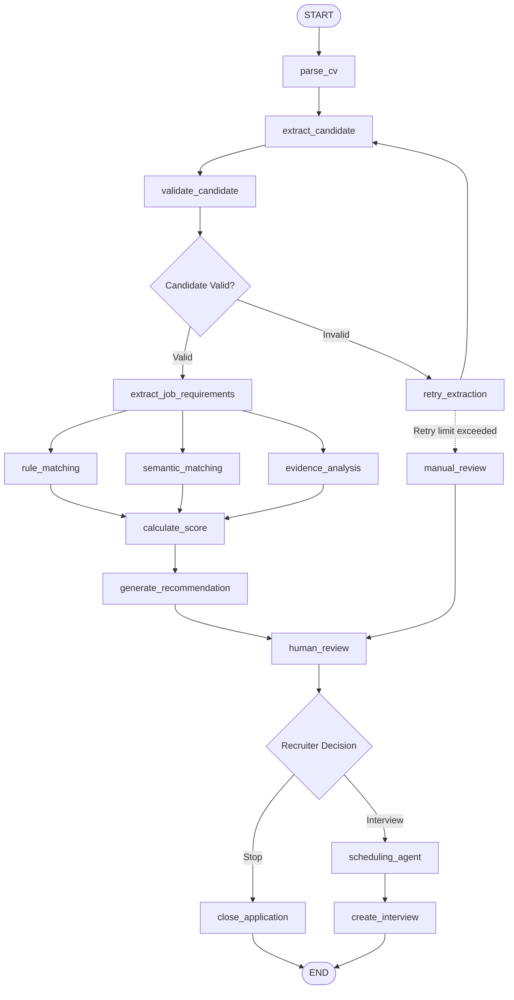

## 9.1. Agent State

Ví dụ:

```python
class RecruitmentState(TypedDict):
    application_id: str

    cv_text: str
    candidate_profile: dict
    job_requirements: dict

    rule_score: float
    semantic_score: float
    evidence: list

    final_score: float
    recommendation: str

    retry_count: int
    errors: list
```

## 9.2. Các node chính

```text
parse_cv
extract_candidate
validate_candidate
extract_job_requirements
rule_matching
semantic_matching
evidence_analysis
calculate_score
generate_recommendation
human_review
scheduling_agent
```

---

# 10. CV Ingestion

Input:

```json
{
  "job_id": "backend-001",
  "resume": "nguyen-van-a.pdf"
}
```

Hệ thống:

1. Lưu file.
2. Sinh `candidate_id`.
3. Sinh `application_id`.
4. Tạo screening job.
5. Push task vào Redis.
6. Worker bắt đầu pipeline.

---

# 11. Document Parsing

Luồng:

```text
PDF / DOCX
    ↓
Docling
    ↓
Structured Text / Markdown
```

Output ví dụ:

```json
{
  "name": "Nguyen Van A",
  "text": "...",
  "sections": {
    "experience": "...",
    "education": "...",
    "skills": "..."
  }
}
```

Nếu parsing thất bại:

```text
Parse Failed
    ↓
Retry
    ↓
Retry Limit?
  /       \
No        Yes
|          |
Retry   Manual Review
```

---

# 12. Candidate Extraction Agent

LLM biến CV text thành schema có cấu trúc.

Ví dụ:

```json
{
  "candidate": {
    "skills": [
      "Python",
      "FastAPI",
      "PostgreSQL",
      "Docker"
    ],
    "experience": [
      {
        "role": "Backend Developer",
        "company": "ABC",
        "duration_months": 24
      }
    ],
    "education": [
      {
        "major": "Computer Science"
      }
    ],
    "projects": [
      {
        "name": "E-commerce Backend",
        "technologies": [
          "FastAPI",
          "PostgreSQL"
        ]
      }
    ]
  }
}
```

Pydantic schema:

```python
from pydantic import BaseModel

class Experience(BaseModel):
    role: str
    company: str | None
    duration_months: int | None

class Education(BaseModel):
    major: str | None

class Project(BaseModel):
    name: str
    technologies: list[str]

class CandidateProfile(BaseModel):
    skills: list[str]
    experience: list[Experience]
    education: list[Education]
    projects: list[Project]
```

---

# 13. Job Requirement Extraction

Input:

```text
Tuyển Backend Python Developer.
Yêu cầu Python, FastAPI, PostgreSQL.
Ưu tiên Docker, Redis.
Ít nhất 2 năm kinh nghiệm.
```

Output:

```json
{
  "title": "Backend Developer",
  "required_skills": [
    "Python",
    "FastAPI",
    "PostgreSQL"
  ],
  "preferred_skills": [
    "Docker",
    "Redis"
  ],
  "minimum_experience": 2
}
```

---

# 14. Matching Engine

Không dùng duy nhất LLM để chấm điểm.

Matching Engine gồm 3 phần.

## 14.1. Rule-based Matching

JD:

```text
Python
FastAPI
PostgreSQL
Docker
```

Candidate:

```text
Python       ✓
FastAPI      ✓
PostgreSQL   ✓
Docker       ✗
```

Skill score:

```text
3 / 4 = 75%
```

Các rule có thể gồm:

```text
required_skill_match
preferred_skill_match
minimum_experience
education_match
project_match
```

---

# 15. Semantic Matching

Mục tiêu: hiểu được các cách diễn đạt khác nhau.

Ví dụ JD:

```text
REST API development
```

CV:

```text
Designed HTTP services using FastAPI
```

Pipeline:

```text
JD Requirement
    ↓
Embedding

CV Experience
    ↓
Embedding

Cosine Similarity
    ↓
pgvector
```

Pseudo-code:

```python
similarity = cosine_similarity(
    requirement_embedding,
    experience_embedding
)
```

---

# 16. Evidence Analysis Agent

LLM phải trả evidence có cấu trúc.

Ví dụ:

```json
{
  "requirement": "FastAPI",
  "matched": true,
  "evidence": "Developed REST APIs using FastAPI",
  "source": "Experience - ABC Company",
  "confidence": 0.92
}
```

UI:

```text
FastAPI                    MATCH
Evidence:
"Built microservices using FastAPI..."

PostgreSQL                 MATCH
Evidence:
"Designed PostgreSQL database..."

Docker                     NOT FOUND
Evidence:
No relevant evidence in CV
```

---

# 17. Scoring

Ví dụ công thức:

```text
Final Score =
    Required Skill Match × 40%
  + Experience Match     × 25%
  + Semantic Similarity  × 20%
  + Preferred Skills     × 15%
```

Candidate:

```text
Required skills:       85
Experience:            90
Semantic similarity:   82
Preferred skills:      60
```

Tính:

```text
85 × 0.40
+ 90 × 0.25
+ 82 × 0.20
+ 60 × 0.15

= 81.9
```

Output:

```json
{
  "score": 81.9,
  "recommendation": "REVIEW_FOR_INTERVIEW",
  "strengths": [
    "Strong Python experience",
    "2 years FastAPI",
    "PostgreSQL experience"
  ],
  "missing_requirements": [
    "No Docker evidence"
  ]
}
```

---

# 18. Human Review

Dashboard:

| Candidate | Score | Recommendation | Action |
|---|---:|---|---|
| Nguyễn Văn A | 87 | Strong Match | Review |
| Trần Văn B | 76 | Potential Match | Review |
| Nguyễn Văn C | 58 | Needs Review | Review |

Luồng:

```text
AI Recommendation
      ↓
Recruiter Dashboard
      ↓
Review Evidence
      ↓
Decision
    /       \
Stop     Interview
           ↓
     Scheduling Agent
```

---

# 19. Scheduling Agent

## 19.1. Flow

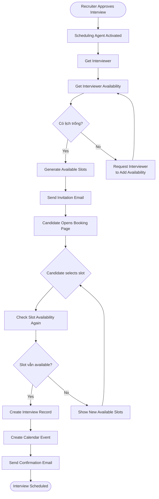

## 19.2. Slot Conflict

Phải kiểm tra lại slot khi booking.

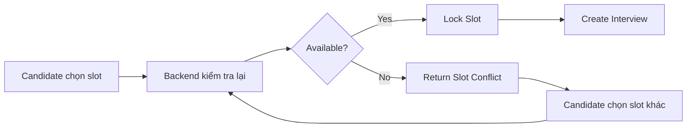

---

# 20. Sequence Diagram: Screening

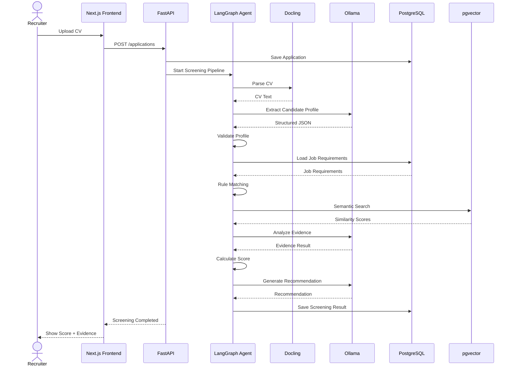

---

# 21. Sequence Diagram: Scheduling

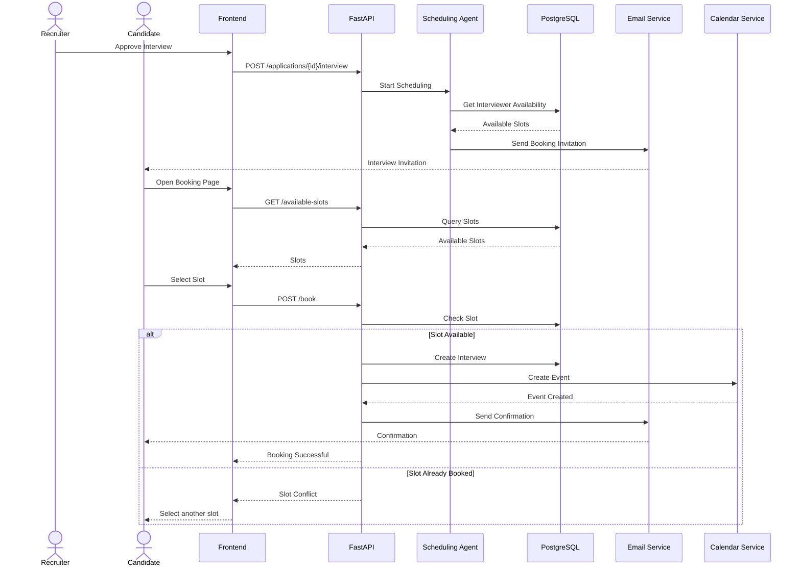

---

# 22. Database Design

## 22.1. Các bảng chính

```text
users
jobs
candidates
resumes
applications
screening_runs
screening_evidence
interviews
availability_slots
audit_logs
```

## 22.2. Quan hệ

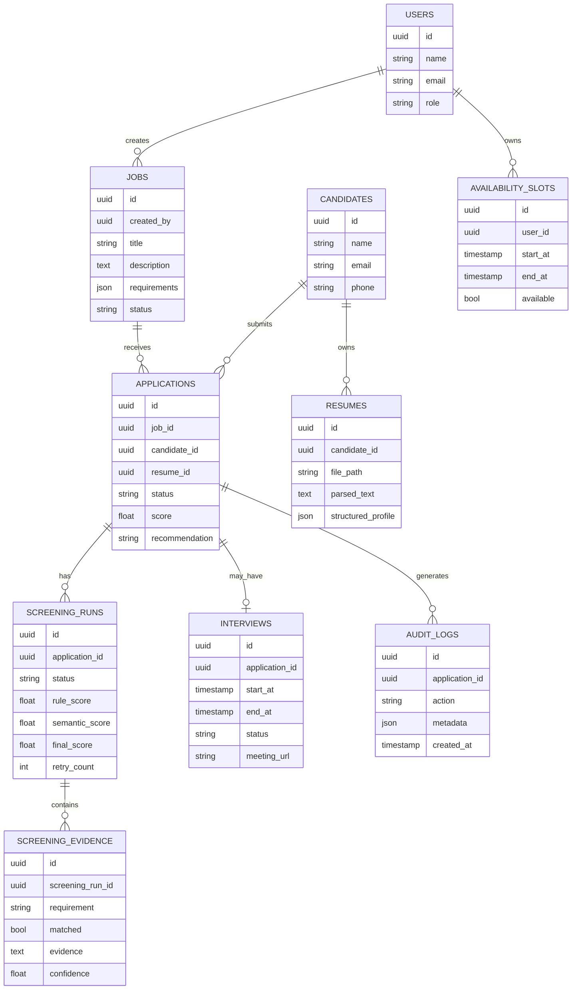

---

# 23. Application Status

Có thể dùng state machine:

```text
NEW
 ↓
PARSING
 ↓
SCREENING
 ↓
WAITING_REVIEW
 ↓
REVIEWED
 ↓
INTERVIEW_PENDING
 ↓
INTERVIEW_SCHEDULED
 ↓
COMPLETED
```

Các trạng thái lỗi:

```text
PARSING_FAILED
SCREENING_FAILED
MANUAL_REVIEW_REQUIRED
```

---

# 24. API Design

## 24.1. Jobs

```http
POST /api/jobs
GET /api/jobs
GET /api/jobs/{job_id}
PUT /api/jobs/{job_id}
DELETE /api/jobs/{job_id}
```

## 24.2. Job AI Extraction

```http
POST /api/jobs/{job_id}/extract-requirements
```

Response:

```json
{
  "required_skills": [],
  "preferred_skills": [],
  "minimum_experience": 2
}
```

## 24.3. Candidates

```http
POST /api/candidates
GET /api/candidates
GET /api/candidates/{candidate_id}
```

## 24.4. Applications

```http
POST /api/applications
GET /api/applications
GET /api/applications/{application_id}
```

## 24.5. Upload Resume

```http
POST /api/applications/{application_id}/resume
```

## 24.6. Screening

```http
POST /api/applications/{application_id}/screen
GET /api/applications/{application_id}/screening
```

## 24.7. Recruiter Review

```http
POST /api/applications/{application_id}/review
```

Request:

```json
{
  "decision": "INTERVIEW",
  "note": "Strong backend experience"
}
```

## 24.8. Scheduling

```http
GET /api/interviewers/{id}/available-slots
POST /api/applications/{id}/interview
POST /api/interviews/{id}/book
GET /api/interviews/{id}
```

---

# 25. Frontend Screens

## 25.1. Dashboard

Hiển thị:

```text
Jobs
Candidates
Awaiting Review
Interviews
Pipeline Errors
```

## 25.2. Jobs List

```text
Backend Developer
Frontend Developer
Data Engineer
```

## 25.3. Create Job

Fields:

```text
Title
Description
Required Skills
Experience
Preferred Skills
```

Action:

```text
Extract requirements with AI
```

## 25.4. Candidate List

```text
Candidate       Score    Status
--------------------------------
Nguyễn Văn A      87     Review
Trần Văn B        82     Review
Lê Văn C          71     Review
```

## 25.5. Candidate Detail

```text
Nguyễn Văn A

Overall match: 87/100

Required Skills
─────────────────────────
Python        ✓
FastAPI       ✓
PostgreSQL    ✓
Docker        ?

Experience
─────────────────────────
Backend: 2.5 years

AI Evidence
─────────────────────────
✓ Python
"Developed backend services using Python..."

✓ FastAPI
"Built REST APIs using FastAPI..."

? Docker
No evidence found
```

Buttons:

```text
Approve Interview
Needs Manual Review
Close Application
```

## 25.6. Pipeline Viewer

```text
✓ CV Uploaded
      │
✓ Document Parsed
      │
✓ Candidate Extracted
      │
✓ Rule Matching
      │
✓ Semantic Matching
      │
✓ Evidence Generated
      │
✓ Score: 87
      │
● Waiting Recruiter Review
```

## 25.7. Interview Booking Page

Candidate thấy:

```text
Backend Developer Interview

Available Slots:

[ 09:00 - 02/09 ]
[ 14:00 - 02/09 ]
[ 10:00 - 03/09 ]
```

---

# 26. Repo Structure

```text
recruitment-agent/
│
├── frontend/
│   ├── app/
│   │   ├── dashboard/
│   │   ├── jobs/
│   │   ├── candidates/
│   │   ├── applications/
│   │   └── interviews/
│   │
│   ├── components/
│   ├── services/
│   └── types/
│
├── backend/
│   ├── app/
│   │   ├── api/
│   │   ├── core/
│   │   ├── models/
│   │   ├── schemas/
│   │   ├── repositories/
│   │   ├── services/
│   │   │
│   │   ├── agents/
│   │   │   ├── recruitment_graph.py
│   │   │   ├── cv_agent.py
│   │   │   ├── job_agent.py
│   │   │   ├── matching_agent.py
│   │   │   ├── evidence_agent.py
│   │   │   └── scheduling_agent.py
│   │   │
│   │   ├── pipeline/
│   │   │   ├── cv_parser.py
│   │   │   ├── extractor.py
│   │   │   ├── validator.py
│   │   │   ├── rule_matcher.py
│   │   │   ├── semantic_matcher.py
│   │   │   └── scorer.py
│   │   │
│   │   ├── workers/
│   │   │   └── screening_worker.py
│   │   │
│   │   └── main.py
│   │
│   └── tests/
│
├── sample-data/
│   ├── cvs/
│   └── jobs/
│
├── scripts/
│
├── docker/
│
├── .github/
│   └── workflows/
│       └── ci.yml
│
├── docker-compose.yml
├── Makefile
├── .env.example
├── README.md
└── docs/
    └── project-design.md
```

---

# 27. Docker Architecture

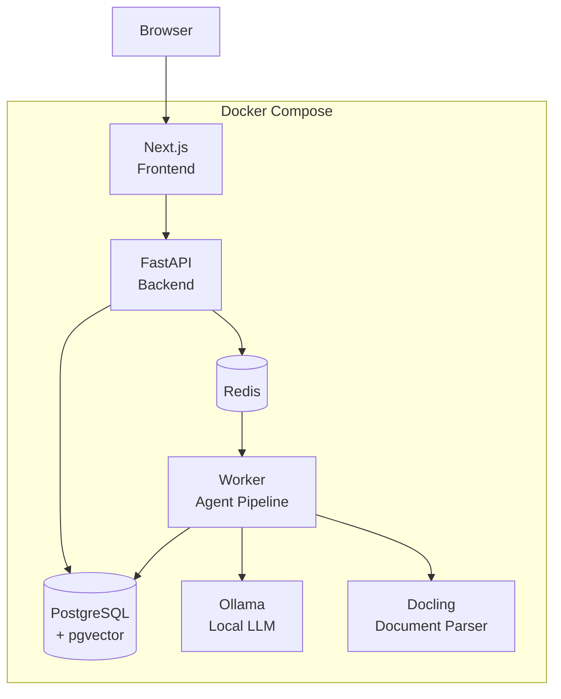

Run project:

```bash
git clone <repository>
cd recruitment-agent
docker compose up -d
```

Frontend:

```text
http://localhost:3000
```

Backend:

```text
http://localhost:8000
```

API Docs:

```text
http://localhost:8000/docs
```

---

# 28. docker-compose Services

Tối thiểu:

```yaml
services:
  frontend:
    build: ./frontend

  backend:
    build: ./backend

  worker:
    build: ./backend

  postgres:
    image: pgvector/pgvector

  redis:
    image: redis

  ollama:
    image: ollama/ollama
```

Có thể thêm:

```text
mailpit
nginx
minio
```

nếu cần.

---

# 29. Background Processing

Không nên để request HTTP chờ toàn bộ AI pipeline chạy.

Thiết kế:

```text
Frontend
   ↓
POST /screen
   ↓
FastAPI
   ↓
Create screening job
   ↓
Redis Queue
   ↓
Worker
   ↓
LangGraph Pipeline
```

Frontend polling:

```http
GET /api/applications/{id}/screening
```

Hoặc sử dụng WebSocket/SSE ở phase sau.

---

# 30. Pipeline Status Tracking

Mỗi node cập nhật trạng thái:

```json
{
  "pipeline": [
    {
      "node": "parse_cv",
      "status": "completed"
    },
    {
      "node": "extract_candidate",
      "status": "completed"
    },
    {
      "node": "semantic_matching",
      "status": "running"
    }
  ]
}
```

Nhờ đó UI có thể hiển thị Pipeline Viewer.

---

# 31. Error Handling

## 31.1. Parsing Error

```text
Parse
 ↓
Failed
 ↓
Retry
 ↓
Retry Limit?
 ↓
Manual Review
```

## 31.2. LLM JSON Error

Dùng structured output + Pydantic.

```text
LLM
 ↓
JSON
 ↓
Pydantic Validation
 ↓
Invalid?
 ↓
Retry Prompt
```

## 31.3. LLM Timeout

```text
Timeout
 ↓
Retry with backoff
 ↓
Max retry?
 ↓
Pipeline failed
```

## 31.4. Booking Conflict

```text
Candidate chọn slot
      ↓
DB Transaction
      ↓
Slot còn trống?
   /          \
 Yes          No
 |             |
Create       Conflict
Interview    Response
```

---

# 32. Audit Log

Mọi quyết định quan trọng nên được ghi lại.

Ví dụ:

```json
{
  "application_id": "app-123",
  "action": "SCREENING_COMPLETED",
  "metadata": {
    "score": 81.9,
    "model": "local-llm",
    "pipeline_version": "v1"
  }
}
```

Audit log dùng để:

- Debug.
- Demo.
- Trace pipeline.
- Giải thích quyết định.
- So sánh các version scoring.

---

# 33. Security cơ bản

MVP nên có:

- JWT authentication.
- Password hashing.
- Role-based access.
- File validation.
- File size limit.
- Chỉ cho phép PDF/DOCX.
- Không render trực tiếp file không tin cậy.
- Không để CV public URL.
- Validate mọi API input.
- Không log dữ liệu nhạy cảm không cần thiết.

Role:

```text
ADMIN
RECRUITER
INTERVIEWER
```

Candidate có thể dùng booking token thay vì account.

---

# 34. Evaluation Dataset

Để đồ án có phần thực nghiệm, nên chuẩn bị:

```text
10 Job Descriptions
100 CV giả lập / anonymized
```

Ground truth:

```text
CV 001 → Backend JD → Strong Match
CV 002 → Backend JD → Medium Match
CV 003 → Backend JD → Weak Match
```

Có thể cho 1–2 người chấm thủ công trước.

---

# 35. Evaluation Metrics

## 35.1. Pipeline

```text
CV parsing success rate
Structured extraction success rate
Pipeline completion rate
Average processing latency
Retry rate
Failure rate
```

## 35.2. Matching

```text
Precision@5
Precision@10
Recall
nDCG
Ranking agreement
```

## 35.3. Extraction

Ví dụ:

```text
Skill extraction accuracy
Experience extraction accuracy
Education extraction accuracy
```

## 35.4. Scheduling

```text
Booking success rate
Slot conflict rate
Average booking completion time
```

---

# 36. Ví dụ kết quả thực nghiệm

Ví dụ format báo cáo:

| Metric | Result |
|---|---:|
| CV parsing success | 97% |
| Structured extraction | 93% |
| Pipeline completion | 96% |
| Precision@5 | 0.84 |
| Average screening time | 12.5s |

Các số trên chỉ là ví dụ format. Kết quả cuối phải lấy từ hệ thống thực tế.

---

# 37. CI Pipeline

Ngoài AI pipeline, project nên có CI pipeline.

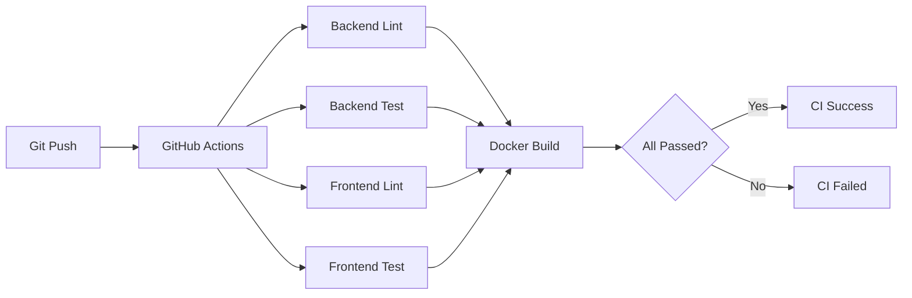

Tasks:

```text
Backend lint
Backend unit test
Frontend lint
Frontend test
Docker build
```

---

# 38. Testing Strategy

## Unit Test

Test:

```text
scoring function
rule matcher
schema validator
availability logic
slot conflict
```

## Integration Test

Test:

```text
Upload CV
 ↓
Parse
 ↓
Extract
 ↓
Score
```

## API Test

Test:

```text
POST /jobs
POST /applications
POST /screen
POST /review
POST /book
```

## End-to-End Test

Luồng:

```text
Create Job
 ↓
Upload CV
 ↓
Screen
 ↓
Approve Interview
 ↓
Book Interview
```

---

# 39. Roadmap triển khai

## Phase 1 — Core Backend

Mục tiêu:

```text
Job CRUD
Candidate CRUD
Application CRUD
Resume Upload
PostgreSQL
```

Không dùng AI ở phase đầu.

Deliverable:

- API chạy.
- DB chạy.
- Swagger chạy.

---

## Phase 2 — CV Processing

Pipeline:

```text
PDF/DOCX
   ↓
Docling
   ↓
Text
   ↓
LLM
   ↓
CandidateProfile
```

Deliverable:

- Upload 1 CV.
- Parse được.
- Trả JSON profile.

---

## Phase 3 — JD Matching

```text
JD
 ↓
JobRequirements

CandidateProfile
 ↓
Rule Matcher
 ↓
Semantic Matcher
 ↓
Evidence
 ↓
Score
```

Deliverable:

- Score ứng viên.
- Có evidence.
- Có recommendation.

---

## Phase 4 — LangGraph Agent

Ghép thành:

```text
CV
 ↓
Parse
 ↓
Extract
 ↓
Validate
 ↓
Match
 ↓
Score
 ↓
Recommendation
```

Deliverable:

- Pipeline chạy end-to-end.
- Có state.
- Có retry.
- Có branching.
- Có logging.

---

## Phase 5 — Human Review + Scheduling

```text
Recruiter Review
      ↓
Approve Interview
      ↓
Scheduling Agent
      ↓
Candidate Booking
      ↓
Interview
```

Deliverable:

- Recruiter approve.
- Candidate chọn slot.
- Interview được tạo.

---

## Phase 6 — UI + Docker + CI

Deliverable:

```text
Dashboard
Candidate Detail
Pipeline Viewer
Scheduling Page
Docker Compose
GitHub Actions
Tests
README
```

---

# 40. Thứ tự code đề xuất

Nên làm đúng thứ tự:

```text
1. Database schema
2. Backend FastAPI
3. Job CRUD
4. Candidate CRUD
5. Application CRUD
6. Resume upload
7. Docling parser
8. Candidate extraction
9. JD extraction
10. Rule matcher
11. Embedding + pgvector
12. Evidence agent
13. Score aggregator
14. LangGraph pipeline
15. Redis worker
16. Recruiter review
17. Scheduling
18. Frontend
19. Pipeline viewer
20. Docker Compose
21. Tests
22. GitHub Actions
```

---

# 41. Sprint Plan đề xuất

## Sprint 1

```text
Project setup
Docker
PostgreSQL
FastAPI
Next.js
Job CRUD
```

## Sprint 2

```text
Candidate
Application
Resume Upload
Docling
```

## Sprint 3

```text
LLM
Candidate Extraction
JD Extraction
Pydantic Validation
```

## Sprint 4

```text
Rule Matching
Embedding
pgvector
Semantic Matching
```

## Sprint 5

```text
Evidence Agent
Scoring
Recommendation
LangGraph
```

## Sprint 6

```text
Dashboard
Candidate Detail
Pipeline Viewer
```

## Sprint 7

```text
Scheduling Agent
Availability
Booking
Email
```

## Sprint 8

```text
Testing
Evaluation
CI
README
Demo
Report
```

---

# 42. Demo Script

Một demo hoàn chỉnh nên đi theo luồng:

## Bước 1

Recruiter tạo job:

```text
Backend Python Developer
```

## Bước 2

AI extract:

```text
Required:
Python
FastAPI
PostgreSQL

Preferred:
Docker
Redis

Experience:
2 years
```

## Bước 3

Upload 3 CV.

## Bước 4

Mở Pipeline Viewer:

```text
✓ Uploaded
✓ Parsed
✓ Extracted
✓ Rule Match
✓ Semantic Match
✓ Evidence
✓ Score
```

## Bước 5

Hiển thị ranking:

```text
Candidate A      87
Candidate B      79
Candidate C      62
```

## Bước 6

Mở Candidate A.

Hiển thị evidence.

## Bước 7

Recruiter chọn:

```text
Approve Interview
```

## Bước 8

Scheduling Agent tạo slots.

## Bước 9

Candidate chọn lịch.

## Bước 10

Interview được tạo.

---

# 43. Điểm nhấn khi bảo vệ

Nếu thầy hỏi:

## “Agent nằm ở đâu?”

Trả lời:

```text
Agent được orchestration bằng LangGraph.

Agent có:
- state
- nhiều node
- tool usage
- branching
- retry
- validation
- human-in-the-loop
```

---

## “Pipeline nằm ở đâu?”

Trả lời:

Có hai pipeline:

### AI Recruitment Pipeline

```text
Parse
 ↓
Extract
 ↓
Validate
 ↓
Rule Matching
 ↓
Semantic Matching
 ↓
Evidence
 ↓
Score
 ↓
Recommendation
```

### Software CI Pipeline

```text
Git Push
 ↓
Lint
 ↓
Test
 ↓
Docker Build
```

---

## “Tại sao không gọi LLM một lần?”

Vì một prompt duy nhất:

- Khó debug.
- Khó kiểm thử.
- Khó explain.
- Khó retry.
- Khó thay component.
- Khó đánh giá từng bước.

Pipeline modular giúp:

```text
Test từng node
Replace model
Debug từng stage
Retry từng stage
Track status
```

---

## “Tại sao cần rule matching nếu đã có LLM?”

Rule matching xử lý các điều kiện deterministic:

```text
Có Python?
Có FastAPI?
Có >= 2 năm kinh nghiệm?
```

LLM được dùng cho các bài toán semantic và evidence.

Điều này giúp hệ thống:

- Ổn định hơn.
- Dễ giải thích.
- Dễ test.
- Giảm phụ thuộc LLM.

---

# 44. Các feature nâng cao sau MVP

Sau khi MVP ổn định có thể thêm:

## Multi-Agent

```text
JD Agent
CV Agent
Matching Agent
Evidence Agent
Scheduling Agent
```

## RAG

Dùng để:

- Chuẩn hóa skill.
- Tra skill taxonomy.
- Map skill tương đương.

## Interview Question Generator

```text
Candidate Profile
+
Job Requirements
      ↓
Interview Question Agent
```

## Recruiter Copilot

Recruiter hỏi:

```text
"Tìm 5 ứng viên mạnh nhất về FastAPI"
```

Agent query DB + vector search.

## Analytics

```text
Applications per job
Average score
Interview conversion rate
Pipeline error rate
```

---

# 45. Open-source Strategy

Mục tiêu là chạy được local/self-host.

Kiến trúc:

```text
LangGraph
     ↓
Agent orchestration

Docling
     ↓
Document parsing

Ollama
     ↓
Local LLM runtime

sentence-transformers
     ↓
Embedding

PostgreSQL + pgvector
     ↓
Database + vector search

FastAPI
     ↓
Backend

Next.js
     ↓
Frontend

Docker Compose
     ↓
Deployment
```

Lưu ý:

> Model LLM chạy bằng Ollama có thể có license riêng. Phải kiểm tra model cụ thể trước khi ghi license vào báo cáo.

---

# 46. Tiêu chí hoàn thành MVP

Project được xem là hoàn thành khi:

- [ ] `docker compose up` chạy được toàn hệ thống.
- [ ] Recruiter tạo được Job.
- [ ] AI extract được Job Requirements.
- [ ] Upload được PDF/DOCX.
- [ ] CV được parse.
- [ ] Candidate Profile được extract.
- [ ] Profile có schema validation.
- [ ] Rule Matching chạy.
- [ ] Semantic Matching chạy.
- [ ] Evidence Analysis chạy.
- [ ] Final Score được tính.
- [ ] Recommendation được sinh.
- [ ] Recruiter xem được ranking.
- [ ] Recruiter xem được evidence.
- [ ] Có Human Review.
- [ ] Recruiter approve interview.
- [ ] Candidate chọn được slot.
- [ ] Interview được tạo.
- [ ] Pipeline Viewer hoạt động.
- [ ] Có error/retry handling.
- [ ] Có audit log.
- [ ] Có unit test.
- [ ] Có CI workflow.
- [ ] Có README hướng dẫn chạy.

---

# 47. Definition of Done

Một feature chỉ được xem là hoàn thành nếu:

```text
Code hoàn thành
+
API chạy
+
Validation
+
Error handling
+
Test
+
Logging
+
Documentation
```

---

# 48. Kiến trúc cuối cùng đề xuất

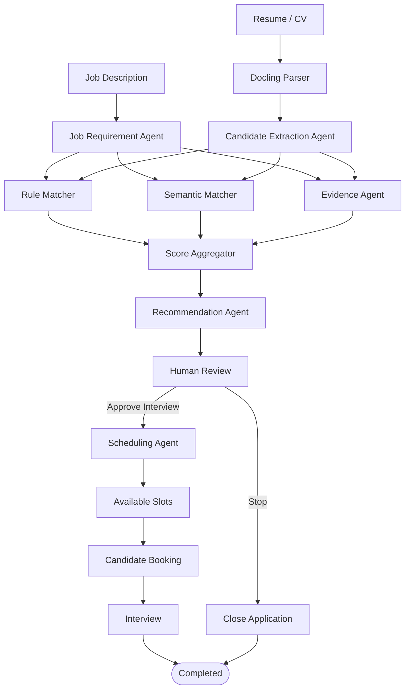

---

# 49. Architecture Summary

Stack nên chốt:

```text
Frontend:
Next.js + Tailwind

Backend:
FastAPI

AI Agent:
LangGraph

Document Parser:
Docling

LLM:
Ollama + local model

Embedding:
sentence-transformers

Database:
PostgreSQL

Vector:
pgvector

Queue:
Redis

Worker:
Celery / RQ

Deployment:
Docker Compose

CI:
GitHub Actions
```

---

# 50. Kết luận

Phiên bản đề tài nên tập trung vào một pipeline duy nhất nhưng làm thật tốt:

```text
JD
 ↓
Upload CV
 ↓
Parse
 ↓
Extract
 ↓
Validate
 ↓
Matching
 ↓
Evidence
 ↓
Scoring
 ↓
Recommendation
 ↓
Recruiter Review
 ↓
Scheduling
 ↓
Interview
```

Điểm mạnh của thiết kế:

- Có AI Agent thực sự.
- Có pipeline rõ ràng.
- Có state và branching.
- Có retry/error handling.
- Có explainable evidence.
- Có human-in-the-loop.
- Có scheduling.
- Có architecture self-host.
- Ưu tiên open source.
- Có Docker.
- Có CI/CD pipeline.
- Có evaluation.
- Có thể demo end-to-end.

Đây là phạm vi đủ sâu cho một đồ án CNTT nhưng vẫn khả thi để triển khai thành sản phẩm demo hoàn chỉnh.
