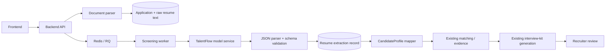

# TalentFlow Phase 04 — Kế hoạch tích hợp model đã fine-tune vào Backend

## 1. Mục tiêu và quyết định phạm vi

Phase 04 đưa artifact `talentflow_export/v1/merged_model` từ notebook vào một inference service có thể vận hành trong production, sau đó tích hợp service này vào pipeline upload CV hiện tại.

Phạm vi thay thế chính xác:

```text
CV text → OpenRouter/OpenMiniMax candidate_profile
```

được thay bằng:

```text
CV text → TalentFlow model → talentflow.resume.v1 → Candidate Profile
```

Model đã train **không thay thế trực tiếp** các tác vụ sau vì notebook không huấn luyện hoặc đánh giá chúng:

- Trích xuất yêu cầu từ Job Description.
- Candidate–Job matching và sinh evidence dạng trích dẫn nguyên văn.
- Sinh interview kit.
- Scheduling.

Trong Phase 04, các tác vụ trên tiếp tục dùng implementation hiện tại (OpenRouter hoặc rules fallback). Nếu mục tiêu cuối cùng là loại bỏ hoàn toàn OpenMiniMax/OpenRouter, cần một workstream riêng sau khi Phase 04 ổn định.

## 2. Baseline đã xác nhận từ ba phase notebook

| Hạng mục | Baseline |
|---|---|
| Dataset | 1.000 CV: 850 train, 75 validation, 75 test |
| Schema | `talentflow.resume.v1`, 24 top-level fields |
| Base model | `Qwen/Qwen2.5-3B-Instruct` |
| Training | QLoRA, context 4.096, 3 epochs |
| Artifact deploy | `talentflow_export/v1/merged_model` |
| Eval cuối | Phase 03 Eval v3, fresh inference, schema-aware |
| JSON valid | 100% trên 75 test samples |
| Schema micro P/R/F1 | 0,9858 / 0,9180 / 0,9507 |
| Macro field F1 | 0,8776 |
| Hallucination / missing fact | 0,51% / 7,35% |
| Generation | `do_sample=false`, input 8.192, output 2.048 tokens |
| Token-limit / input truncation | 0% / 0% |
| T4 latency tham chiếu | trung bình 58,8 giây/CV |

Baseline này là điều kiện đối chiếu cho production regression; không phải SLO production cuối cùng.

Các field cần theo dõi riêng: `skills`, `min_salary`, `max_salary`, `ready_to_relocation`, `job_expectations` và các nested field của `projects`.

## 3. Hiện trạng code và khoảng cách cần xử lý

Pipeline hiện tại:

```text
Upload PDF/DOCX/TXT
  → backend/app/resume.py extract text + candidate identity
  → Application + AgentRun + AgentTask
  → Redis/RQ worker
  → screen_candidate_ai()
       ├─ OpenRouter sinh candidate_profile + evidence
       └─ rules fallback nếu provider lỗi
  → generate_interview_kit_ai()
  → calibration + persistence + recruiter review
```

Các điểm tích hợp hiện hữu:

- `backend/app/llm.py`: một OpenRouter client dùng chung cho JD, screening/profile và interview kit.
- `backend/app/worker.py`: screening và interview kit chạy trong cùng một RQ task.
- `backend/app/models.py`: profile đang nằm lồng trong JSON `Application.screening`; chưa có extraction record/version độc lập.
- `backend/app/config.py` và `docker-compose.yml`: chỉ có cấu hình OpenRouter, chưa có model service.
- Timeout task mặc định là 120 giây, trong khi riêng model trên Kaggle T4 đã mất trung bình 58,8 giây/CV.
- Upload tối đa 20 CV đã là async, phù hợp để nối thêm GPU worker; không cần đổi API upload sang synchronous.

## 4. Kiến trúc đích



Ranh giới service:

```text
Backend business code
  └─ ResumeExtractor interface
       └─ TalentFlowHttpExtractor
            └─ POST /v1/resume/extract
                 └─ merged_model v1 trên GPU
```

Backend không import Transformers/PyTorch và không load model vào web hoặc RQ worker process.

## 5. API contract v1

### Request

```http
POST /v1/resume/extract
Content-Type: application/json
X-Request-ID: <uuid>
```

```json
{
  "request_id": "uuid",
  "resume_text": "...",
  "schema_version": "talentflow.resume.v1"
}
```

### Success

```json
{
  "request_id": "uuid",
  "model_name": "talentflow-qwen2.5-3b",
  "model_version": "v1",
  "prompt_version": "talentflow.resume.prompt.v1",
  "schema_version": "talentflow.resume.v1",
  "data": {},
  "meta": {
    "json_valid": true,
    "schema_valid": true,
    "input_tokens": 0,
    "output_tokens": 0,
    "input_truncated": false,
    "token_limit_hit": false,
    "latency_ms": 0
  }
}
```

### Error taxonomy

| HTTP | Code | Retry? |
|---:|---|---|
| 400 | `EMPTY_RESUME` / `INPUT_TOO_LARGE` | Không |
| 422 | `JSON_PARSE_FAILED` / `SCHEMA_VALIDATION_FAILED` | Tối đa 1 lần, sau đó review |
| 429 | `MODEL_BUSY` | Có backoff |
| 503 | `MODEL_NOT_READY` / `GPU_TEMPORARY_ERROR` | Có backoff |
| 504 | `INFERENCE_TIMEOUT` | Có, nếu còn attempt |

`request_id` phải idempotent ở phía Backend. Model service không lưu Candidate hay quyết định tuyển dụng.

## 6. Work breakdown structure

### WP0 — Chốt contract và artifact

**Owner:** ML + Backend
**Dependency:** Phase 03 export hoàn tất

Công việc:

- Đóng gói đúng `merged_model`, tokenizer, chat template và `phase3_manifest.json`.
- Tạo checksum cho toàn bộ artifact và metadata `model_version=v1`.
- Chuyển 24 field thành JSON Schema và Pydantic model dùng chung về mặt contract.
- Giữ đúng system prompt của Phase 01, version hóa thành `talentflow.resume.prompt.v1`.
- Chốt quy tắc unknown: scalar là `null`, collection là `[]`.
- Chốt mapper từ 24 field sang cấu trúc `candidate_profile` hiện tại.

**Deliverable:** model bundle bất biến, JSON Schema v1, mapping document.
**Exit:** reload artifact và smoke test cho output JSON hợp lệ.

### WP1 — Xây TalentFlow model service

**Owner:** ML/Platform
**Dependency:** WP0

Công việc:

- Tạo service riêng, ưu tiên FastAPI cho bản đầu.
- Load model một lần khi process khởi động; readiness chỉ xanh sau khi load xong.
- Dùng chat template/tokenizer từ artifact.
- Cấu hình inference: `do_sample=false`, `max_input_tokens=8192`, `max_new_tokens=2048`.
- Decode chỉ phần generated tokens; tách JSON bằng balanced-brace parser.
- Validate 24 field và nested types trước khi trả `data`.
- Thêm concurrency limit phù hợp VRAM, queue nội bộ ngắn và trả `MODEL_BUSY` khi quá tải.
- Không ghi raw CV/output vào log; log hash, token counts, version, latency và error code.
- Thêm `GET /health`, `GET /ready`, graceful shutdown và warm-up request.
- Tạo Docker image và mount model read-only tại `/models/talentflow/v1/merged_model`.

**Deliverable:** container `talentflow-model:v1` và OpenAPI contract.
**Exit:** contract tests, restart/reload test, malformed/oversized input tests đều đạt.

### WP2 — Thêm extraction domain vào Backend

**Owner:** Backend
**Dependency:** WP0

Công việc:

- Tạo `ResumeExtractor` protocol/interface.
- Implement `TalentFlowHttpExtractor` với timeout, retry có giới hạn và request ID.
- Tách `candidate_profile` khỏi `_profile()` trong `backend/app/llm.py`.
- Sửa `screen_candidate_ai()` để chỉ còn matching/evidence; không ghi đè profile do TalentFlow sinh.
- Tạo mapper từ `talentflow.resume.v1` sang view hiện tại:
  - `skills[].skill_name` → danh sách skill dùng cho UI/matching.
  - `years_experience` hoặc `job_experience` → `experience_years` theo rule đã chốt.
  - `educations` → summary/list phù hợp contract hiện tại.
  - `about`, experience, project → summary có kiểm soát; không tự bịa nội dung.
- Duy trì raw 24-field object làm nguồn chuẩn để các downstream mới không phụ thuộc mapper rút gọn.

**Deliverable:** adapter, schema model, mapper và unit tests.
**Exit:** Backend có thể đổi extractor qua config mà business code không biết engine bên dưới.

### WP3 — Persistence và workflow migration

**Owner:** Backend/Data
**Dependency:** WP2

Tạo Alembic migration cho bảng `resume_extractions`:

```text
id, owner_id, application_id, run_id
status, attempt
model_name, model_version, prompt_version, schema_version
resume_text_hash
raw_output_encrypted_or_null
validated_data
json_valid, schema_valid
input_tokens, output_tokens
input_truncated, token_limit_hit
latency_ms, error_code, error_message
created_at, finished_at
```

Quy tắc dữ liệu:

- `validated_data` là JSON 24 field và chỉ có khi schema pass.
- Không nhân bản raw CV text sang bảng mới; tham chiếu `Application.resume_text` và lưu hash.
- Mặc định không lưu raw generation. Nếu cần debug tạm thời, phải mã hóa, giới hạn retention và audit quyền đọc.
- Không cập nhật Candidate/Profile nếu schema fail.

Tách worker thành các node quan sát được:

```text
resume_extract
→ resume_validate
→ candidate_map
→ screen_candidate
→ generate_interview_kit
→ calibrate
→ complete
```

Giữ một RQ job orchestration ở vòng đầu để giảm thay đổi, nhưng lưu checkpoint sau extraction để retry screening không phải chạy lại GPU. Mỗi node cần idempotent theo `application_id + model_version + resume_checksum`.

**Deliverable:** migration, repository/service và workflow mới.
**Exit:** retry sau lỗi interview kit tái sử dụng extraction hợp lệ; không gọi lại model ngoài ý muốn.

### WP4 — Config, deploy và capacity

**Owner:** Platform/DevOps
**Dependency:** WP1, WP3

Thêm cấu hình:

```env
RESUME_EXTRACTOR_PROVIDER=talentflow
TALENTFLOW_MODEL_URL=http://talentflow-model:8000
TALENTFLOW_MODEL_NAME=talentflow-qwen2.5-3b
TALENTFLOW_MODEL_VERSION=v1
TALENTFLOW_SCHEMA_VERSION=talentflow.resume.v1
TALENTFLOW_PROMPT_VERSION=talentflow.resume.prompt.v1
TALENTFLOW_CONNECT_TIMEOUT_SECONDS=5
TALENTFLOW_READ_TIMEOUT_SECONDS=120
TALENTFLOW_MAX_INFERENCE_ATTEMPTS=2
```

Các việc deploy:

- Thêm `talentflow-model` vào compose/staging stack; GPU reservation và persistent model volume.
- Backend và worker cùng nhận model URL/version, nhưng chỉ worker gọi inference.
- Điều chỉnh `TASK_TIMEOUT_SECONDS` sau benchmark end-to-end; giá trị 120 giây hiện tại có nguy cơ thiếu vì task còn matching và interview kit.
- Xác định concurrency từ benchmark thay vì tăng worker tùy ý. Với baseline 58,8 giây/CV, một GPU tuần tự chỉ đạt xấp xỉ 61 CV/giờ; batch 20 CV có thể mất gần 20 phút ở worst-case queue tuần tự.
- Thiết lập CPU/RAM/VRAM limits, restart policy, readiness dependency và alert khi model load fail.

**Deliverable:** staging deployment reproducible và capacity report.
**Exit:** soak test batch 20 CV không OOM, queue không mất job và timeout phù hợp.

### WP5 — Test và production regression

**Owner:** QA + ML + Backend
**Dependency:** WP1–WP4

Test pyramid:

1. **Unit**
   - Balanced JSON parser, schema validator, normalizer và mapper.
   - Null/list behavior đủ 24 field.
   - Retry classification và idempotency.
   - `skills`, salary, relocation và project edge cases.
2. **Contract**
   - Backend client ↔ model OpenAPI.
   - Success/error payload, request ID và version metadata.
3. **Integration**
   - Upload → RQ → model service → extraction record → screening → review.
   - Model unavailable, timeout, invalid JSON, schema fail và worker restart.
4. **Regression ML**
   - Chạy lại đúng 75 test CV qua HTTP production path, không gọi model trực tiếp trong notebook.
   - Dùng chính schema-aware evaluator v3 để tránh thay metric definition.
5. **Security/privacy**
   - Không lộ CV/PII trong logs và traces.
   - Tenant isolation cho extraction record.
   - Model endpoint chỉ truy cập từ internal network.
6. **Load/soak**
   - Batch 1, 5 và 20 CV; theo dõi latency, queue age, GPU memory và failure recovery.

Go/no-go staging:

| Metric | Gate đề xuất |
|---|---:|
| JSON valid rate | ≥ 99% |
| Schema valid rate | ≥ 99% |
| Schema micro F1 trên 75 test CV | ≥ 0,94 |
| Schema micro recall | ≥ 0,90 |
| Token-limit hit | ≤ 1% |
| Input truncation | ≤ 1% |
| PII xuất hiện trong application logs | 0 case |
| Crash/OOM trong soak test | 0 case |

Ngưỡng latency production chỉ chốt sau benchmark trên GPU đích. Tạm thời thu p50/p95/p99, không lấy latency Kaggle T4 làm SLO chính thức.

### WP6 — Rollout và rollback

**Owner:** Backend + Platform + Product
**Dependency:** WP5 đạt gate

Các bước rollout:

1. Local/integration environment: 100% TalentFlow.
2. Staging: replay bộ test và CV staging được phép sử dụng.
3. Shadow mode production: chạy TalentFlow song song, không ghi đè profile đang dùng; so schema, mapping, latency và tỷ lệ review.
4. Canary theo tenant hoặc stable hash: 10% → 50% → 100%.
5. Giữ feature flag rollback trong ít nhất một chu kỳ vận hành đã thỏa thuận.
6. Sau khi ổn định, bỏ phần `candidate_profile` khỏi prompt OpenRouter screening và xóa code parse profile cũ.

Rollback chỉ đổi `RESUME_EXTRACTOR_PROVIDER` hoặc routing config; không rollback DB migration. Extraction record giữ nguyên để audit.

Không âm thầm fallback từng request sang OpenMiniMax. Nếu buộc phải fallback trong canary, record phải ghi rõ provider, primary error và `manual_review_required=true`; số liệu fallback không được tính là chất lượng TalentFlow.

### WP7 — Observability và feedback loop

**Owner:** Platform + ML/Product Ops
**Dependency:** WP3, WP4

Dashboard tối thiểu:

- `resume_extraction_total{status,model_version,error_code}`
- JSON/schema valid rate.
- Input/output token histogram; truncation và token-limit hit.
- Inference latency p50/p95/p99 và queue wait p50/p95.
- GPU memory/utilization, model restarts, readiness failures.
- `skills_empty_rate`, salary anomaly rate, relocation unknown rate.
- Manual-review rate và correction rate theo field.

Feedback loop:

```text
Reviewer correction
→ lưu diff theo field + model version
→ loại PII/kiểm tra consent
→ tạo hard-case dataset
→ đánh giá drift
→ chỉ mở Phase 05 retraining khi đủ dữ liệu
```

## 7. Thứ tự triển khai và dependency

```text
WP0 Contract/artifact
 ├─→ WP1 Model service ─┐
 └─→ WP2 BE adapter ────┼─→ WP3 Persistence/workflow
                        └─→ WP4 Deploy/capacity
WP3 + WP4 ─→ WP5 Test/regression ─→ WP6 Rollout
WP3 + WP4 ─→ WP7 Observability (hoàn tất trước canary)
```

Critical path: `WP0 → WP1/WP2 → WP3 → WP4 → WP5 → WP6`.

## 8. Mapping thay đổi theo repository hiện tại

| Khu vực | Thay đổi dự kiến |
|---|---|
| `backend/app/config.py` | Thêm TalentFlow URL/version/timeouts/provider flag |
| `backend/app/llm.py` | Bỏ trách nhiệm profile extraction khỏi screening prompt/parser |
| `backend/app/worker.py` | Thêm extraction/validation/map trước screening; checkpoint và retry đúng node |
| `backend/app/models.py` | Thêm `ResumeExtraction` |
| `backend/app/workflow.py` | Thêm các node extraction chi tiết |
| `backend/app/main.py` | Khởi tạo run metadata đúng provider/version; expose extraction status khi cần |
| `backend/alembic/versions/` | Migration bảng và index mới |
| `backend/tests/` | Unit, contract, integration, retry, tenant/privacy tests |
| `docker-compose.yml` | Thêm model service/GPU, env và readiness |
| `.env.example`, `backend/.env.example` | Cấu hình mới; ghi rõ OpenRouter vẫn dùng cho tác vụ nào |
| `README.md`, runbook | Flow mới, cách deploy model, rollback và troubleshooting |

Thư mục mới đề xuất:

```text
model-service/
├── app/
│   ├── main.py
│   ├── inference.py
│   ├── prompting.py
│   ├── json_parser.py
│   └── schema.py
├── tests/
├── Dockerfile
└── requirements.txt

backend/app/resume_extraction/
├── contract.py
├── client.py
├── mapper.py
└── service.py
```

## 9. Rủi ro và biện pháp

| Rủi ro | Tác động | Biện pháp |
|---|---|---|
| Hiểu “thay OpenMiniMax” là thay mọi tác vụ | Matching/interview kit giảm chức năng | Chỉ thay resume extraction; tạo roadmap riêng cho zero external LLM |
| Prompt/chat template khác notebook | Metric production giảm | Version prompt; regression qua HTTP path |
| Timeout/OOM khi batch lớn | Job retry hàng loạt | Concurrency limit, benchmark, node checkpoint, task timeout phù hợp |
| Output JSON hợp lệ nhưng mapping sai | UI/screening dùng dữ liệu sai | Contract tests và golden mapper fixtures |
| Retry chạy model nhiều lần | Tốn GPU, tăng queue | Cache/idempotency theo checksum + model version |
| Field yếu được dùng như hard decision | Reject sai ứng viên | Salary/relocation/job expectations là soft signal hoặc manual review |
| Raw CV/output lộ trong logs | Rủi ro privacy | Log metadata/hash; retention và encryption nếu lưu raw output |
| Shadow dùng OpenMiniMax làm ground truth | Đánh giá lệch | Dùng labeled 75-set và reviewer corrections; shadow chỉ tìm incompatibility |
| Dataset synthetic khác production | Drift chất lượng | Theo dõi correction rate và xây hard-case set có consent |

## 10. Definition of Done Phase 04

- [ ] Artifact v1 có checksum, manifest, tokenizer/chat template và rollback target.
- [ ] Model service độc lập có health/readiness, deterministic inference và schema validation.
- [ ] Backend gọi model qua `ResumeExtractor`, không import ML runtime.
- [ ] Profile 24 field được lưu cùng model/prompt/schema version và request trace.
- [ ] OpenRouter screening không sinh hoặc ghi đè Candidate Profile.
- [ ] Retry không chạy lại extraction đã hoàn tất với cùng checksum/model version.
- [ ] Upload batch 20 CV vẫn async và trạng thái hiển thị đúng.
- [ ] Regression 75 mẫu đạt toàn bộ go/no-go gate.
- [ ] Matching/evidence, interview kit, recruiter review và scheduling không regression.
- [ ] Dashboard/alert và manual-review path hoạt động.
- [ ] Canary 100% hoàn tất, rollback đã diễn tập.
- [ ] README, env example và production runbook đã cập nhật.

## 11. Các quyết định cần chốt trước khi code

1. GPU/engine production v1: Transformers, vLLM hay engine khác; phải benchmark output parity trước khi đổi engine.
2. Có lưu raw model output hay chỉ lưu validated JSON; nếu lưu thì retention và encryption là gì.
3. Candidate Profile canonical là toàn bộ 24 field hay vẫn giữ view rút gọn trong `screening.candidate_profile` để tương thích UI.
4. Sau Phase 04 có tiếp tục OpenRouter cho JD/evidence/interview kit hay mở phase riêng để loại bỏ hoàn toàn.
5. Ai sở hữu manual-review queue và correction labels.

Khuyến nghị cho bản đầu: dùng 24-field extraction record làm canonical source, giữ `screening.candidate_profile` rút gọn như compatibility view, và chỉ loại OpenMiniMax khỏi riêng bước profile extraction.
